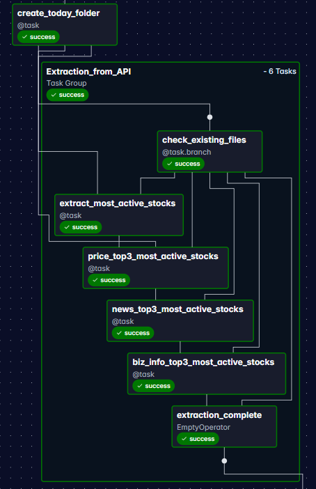
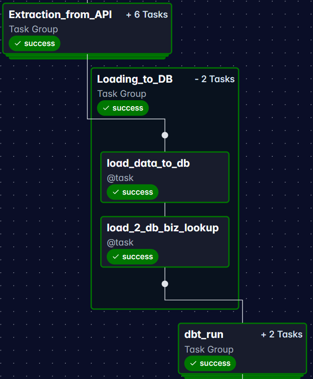
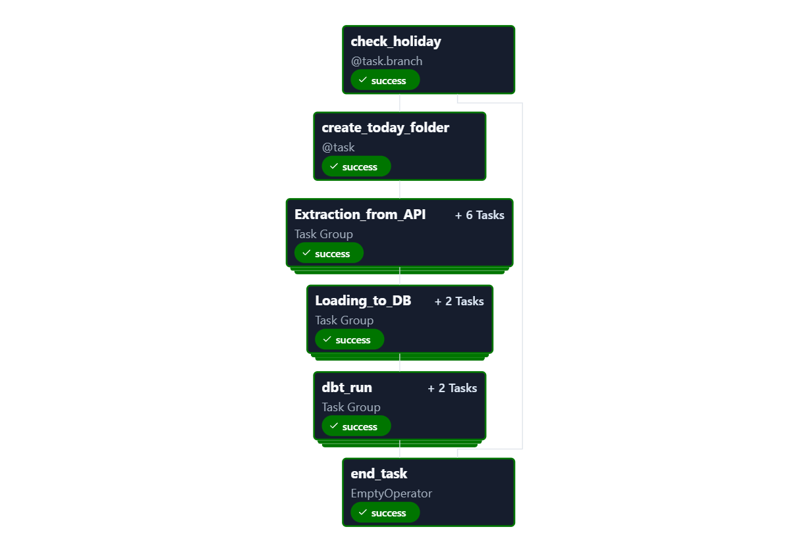
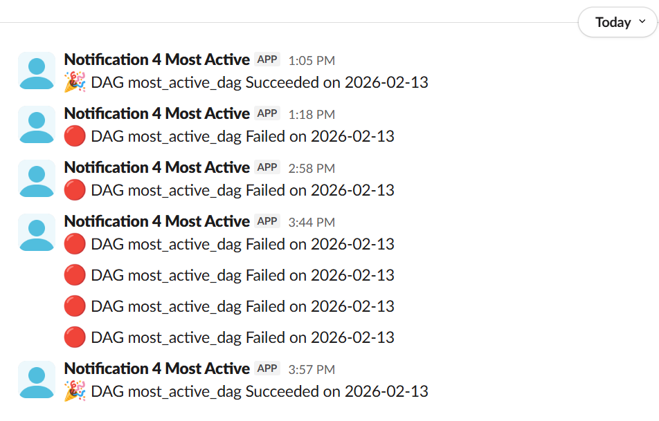
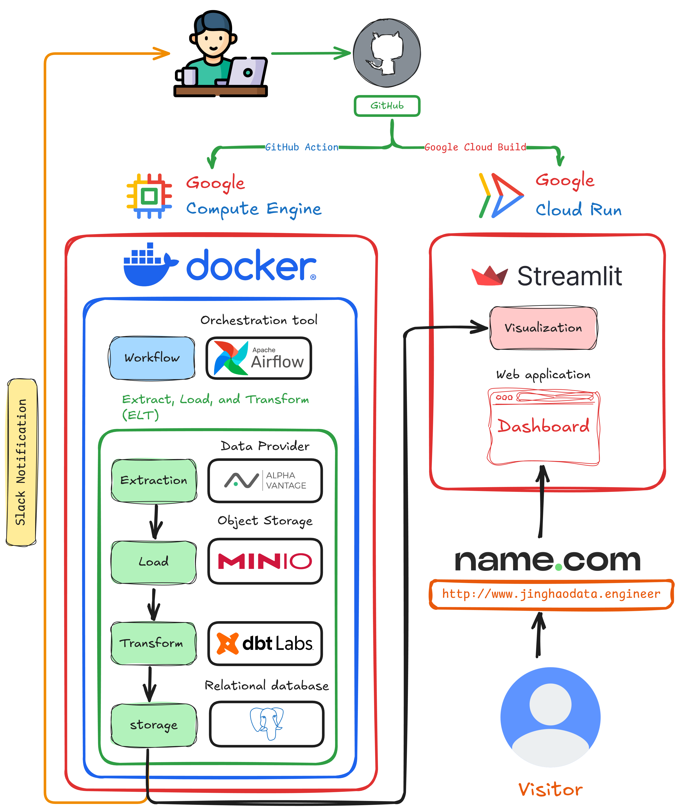

# Data Engineering Capstone - ELT Pipeline

## 🔄 Stock & News Data Pipeline
> 🏗️ **Backend Repository** for the Data Engineering Capstone Project.

### 📖 Table of Contents
- [Project Overview](#-project-overview)
- [Features](#-features)
- [Potential Improvements](#bulb-potential-improvements)
- [Tech Stack](#-tech-stack)
- [Project Structure](#-project-structure)
- [Local Setup](#-local-setup)
- [Reference](#-reference)
- [Connect with me](#connect-with-me)


### 🚀 Project Overview


This repository hosts the **Backend ELT Pipeline** for my Data Engineering Capstone Project. It orchestrates the end-to-end flow of financial data—from API extraction to analytical data marts.

This project complements the **Frontend Visualization Suite**, which consumes the processed data to build interactive dashboards.
> 🌐 **Live Demo:** [JINGHAOdata.engineer](https://www.jinghaodata.engineer/)

👉 [View Frontend Repository](https://github.com/chenjinghao/de-project-2-Streamlit-4-Viz)

Together, they demonstrate a robust data platform capable of handling ingestion, storage, transformation, and serving.

#### 🏗️ Methodology: Decomposition & Iterative Learning

To bridge the gap between theory and practice, I applied a strategy rooted in **Decomposition** and **Just-In-Time (JIT) Learning**. This approach allowed me to construct a strong foundation for my Data Engineering career:

1.  **🔍 Research & Scope**: I first analyzed the Data Engineering landscape to identify industry-standard tools and core responsibilities.
2.  **🧩 Decomposition**: I broke the complex pipeline down into manageable components (Orchestration, Transformation, Storage).
3.  **📚 Learn & Implement**:
    *   **Orchestration**: I took specialized courses on **Apache Airflow**, then immediately built the ingestion logic for this project.
    *   **Transformation**: I shifted focus to **dbt**, mastering analytics engineering concepts before implementing the transformation layer of this project.

This iterative process ensured that every component was built with a deep understanding of the underlying technologies.

### 🌟 Features

#### 1. Data Orchestration & Ingestion (Airflow)
*   **Avoid Duplicate Extraction**: The extraction workflow implements logic to prevent redundant API calls, ensuring efficient data ingestion. Check the **_Task Group: Extract Stock Info_** for more details in **_Airflow Task Flow Diagram_** collapsed section.

*   **Hybrid Storage Strategy**:
    *   **Data Lake (MinIO)**: Raw API responses are stored in S3-compatible object storage for auditability and replayability.
    *   **Data Warehouse (PostgreSQL)**: Structured data is loaded for high-performance querying.
*   **Slack Alerts**: Real-time notifications for pipeline successes or failures.

<details>

<summary>Airflow Task Flow Diagram</summary>

   <details>

   <summary>Task Group: Extract Stock Info</summary>
   
   The flow is designed to avoid duplicate extraction from API since Alpha Vantage put a 25 per day request limit on free account.

   

   </details>

   <details>

   <summary>Task Group: Load to Database</summary>

   

   </details>

   <details>

   <summary>Task Group: DBT run</summary>

   

   </details>



</details>

<details>

<summary>Slack Notification</summary>



</details>

#### 2. Data Transformation (dbt)
*   **Modular Architecture**: Follows the Staging -> Intermediate -> Mart structure.
*   **Complex Logic**: Calculates rolling averages (100-day), volatility metrics, and aggregates news sentiment scores.
*   **Data Quality**: Implements rigorous testing within the pipeline:
    *   `unique` & `not_null` checks for primary keys.
    *   `accepted_values` for sentiment labels (e.g., 'Bullish', 'Bearish').
    *   Custom tests for data freshness.

#### 3. Infrastructure & DevOps


<details>

<summary>Infrastructure ver. 1 (Legacy)</summary>

   ### Google composer + cloud SQL

> *Note: This infrastructure costs approximately USD 50+ per month after taking free tier quota into consideration. However, it is easier to setup, and it run faster than Google Cloud VM*


</details>

### :bulb: Potential Improvements

*   **Advanced Data Quality**: Integrating a dedicated tool like **Great Expectations** could enhance data validation. However, given that the data provider delivers structured data and the volume is relatively small, I opted to rely on **dbt's built-in testing features**. This approach avoids the resource overhead of deploying additional services on the Virtual Machine (VM), ensuring optimal performance and cost-effectiveness.

### 🛠️ Tech Stack

*   **Orchestration**: Apache Airflow and Cosmos from Astronomer 
*   **Transformation**: dbt Core (Data Build Tool)
*   **Languages**: Python, SQL
*   **Database**: PostgreSQL
*   **Object Storage**: MinIO (S3 Compatible)
*   **Infrastructure**: Docker, Google Cloud Platform (GCP)
*   **CI/CD**: GitHub Actions

### 📂 Project Structure

```text
de-project-1-airflow-dbt-4-ELT/
├── dags/                        # Airflow DAGs (Extraction logic)
├── include/
│   ├── connection/              # Connection to Minio(Objective storage),
│   │                              optional to connect Google Cloud Storage
│   ├── dbt/my_project/          # dbt project (Transformation logic)
│   │   ├── models/              # SQL models (Staging, Marts)
│   │   └── dbt_project.yml      # dbt configuration
│   └── tasks/                   # Task groups
│   │   ├── checking_b4_extraction.py/  # Check to avoid duplication and holiday
│   │   └── extract_stock_info.py/      # Extract info. from Alpha Vantage API
│   │   └── load_2_db.py/               # Load data to PostgreSQL   
├── .github/workflows/           # CI/CD deployment pipelines
├── docker-compose.override.yml  # Local infrastructure (MinIO, Postgres)
├── requirements.txt             # Python dependencies
└── README.md
```

### ⚙️ Local Setup

1.  **Prerequisites**
    *   Docker Desktop installed and running.
    *   Astro CLI installed.

2.  **Clone the repository**
    ```bash
    git clone https://github.com/chenjinghao/de-project-1-airflow-dbt-4-ELT.git
    cd de-project-1-airflow-dbt-4-ELT
    ```

3.  **Configure Environment**
    Create a `.env` file in the root directory with your credentials:

    ```bash
    # Postgres
    POSTGRES_USER=postgres
    POSTGRES_PASSWORD=postgres
    POSTGRES_DB=stocks_db
    POSTGRES_PORT=5000

    # MinIO
    MINIO_ROOT_USER=minioadmin
    MINIO_ROOT_PASSWORD=minioadmin

    # APIs
    ALPHA_VANTAGE_API_KEY=your_api_key
    SLACK_API_TOKEN=your_slack_token
    ```

      - .gitignore this file
      - the varians defined in `.env` will pass to `docker-compose.override.yml`
         ```bash
         #use following command to check 
         docker compose -f docker-compose.override.yml config
         ```

4.  **Start the Airflow Environment**
    ```bash
    astro dev start
    ```
    *   **Airflow UI**: http://localhost:8080
    *   **MinIO Console**: http://localhost:19001
    *   **pgAdmin**: http://localhost:5800 
5. **Setup airflow connection and pool**
   * The Astro CLI is designed to automatically import airflow_settings.yaml into your Airflow environment upon startup.
      - or use command ``` astro dev object import ```
   * Environment Variables defined in `.env` must have the same name as in `airflow_settings.yaml`

6. **Common issues**
   * Port 5432 taken by another image
        - Solution:
        ```bash
        E:\myprojects\de-project-1-airflow-dbt-4-ELT>netstat -ano|findstr :5432
        TCP    127.0.0.1:5432         0.0.0.0:0              LISTENING       41692

        E:\myprojects\de-project-1-airflow-dbt-4-ELT>taskkill /pid 41692 /f
        SUCCESS: The process with PID 41692 has been terminated.
        ```
### Reference
*   **Courses**
      *   [Learn Apache Airflow from Astronomer Academy](https://academy.astronomer.io)
      *   [Apache Airflow: The Hands-On Guide](https://www.udemy.com/course/the-ultimate-hands-on-course-to-master-apache-airflow/)
      *   [dbt Certified Developer Path](https://learn.getdbt.com/learn/learning-path/dbt-certified-developer)
      *   **Youtube**
            -   [Data Engineering Zoomcamp](https://datatalks.club/blog/data-engineering-zoomcamp.html)
            -   [How to build an automated data pipeline using Airflow, dbt, Postgres, and Superset](https://youtu.be/vMgFadPxOLk?si=Iq_KD8kIq0kHRmTr)
            -   [Code along - build an ELT Pipeline in 1 Hour (dbt, Snowflake, Airflow)](https://youtu.be/OLXkGB7krGo?si=INsSOx6lxBelpgPw)
            -   [How to Add Slack Notifications to Your Airflow DAG's with Airflow Notifiers!](https://youtu.be/4yQJWnhKEa4?si=YINvm_1zTnCQJmmF)

*   **Documentation**
      *   [Astronomer Documentation](https://www.astronomer.io/docs)
      *   [dbt Documentation](https://docs.getdbt.com/docs/build/documentation)
      *   [Alpha Vantage API](https://www.alphavantage.co)
      *   [Slack API](https://api.slack.com)
      *   [MinIO Documentation](https://min.io/docs)
      *   [PostgreSQL Documentation](https://www.postgresql.org/docs/)
      *   [Docker Documentation](https://docs.docker.com)

## Connect with me
To know more about me and my projects, please visit my personal website: 

:globe_with_meridians: [https://adamchenjinghao.notion.site](https://adamchenjinghao.notion.site)

:email: [Adam_CJH@outlook.com](mailto:Adam_CJH@outlook.com)
:raising_hand_man: [Linkedin.com/in/chenjinghao/](https://www.linkedin.com/in/adam-cjh)
