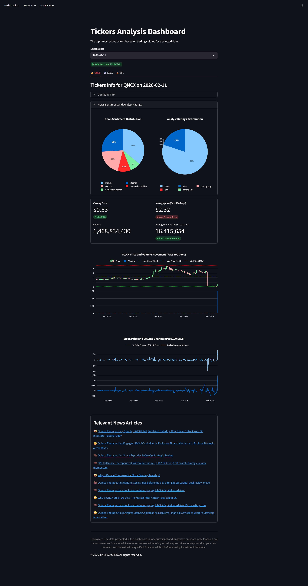
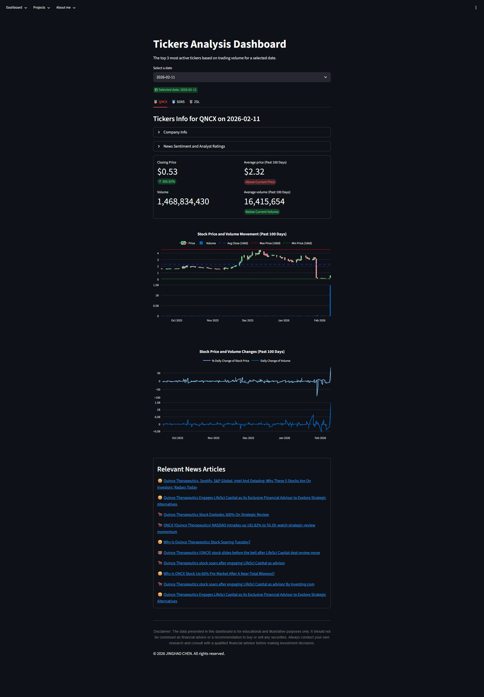
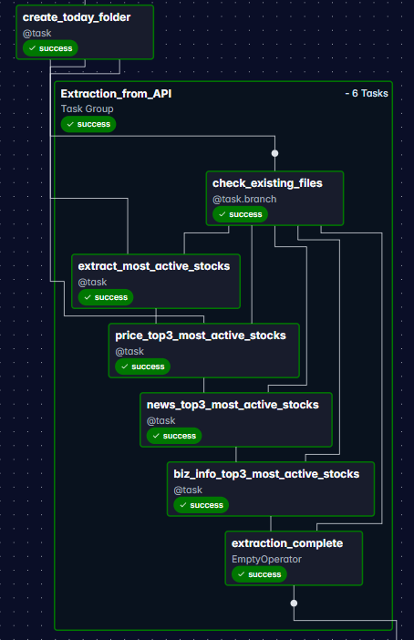
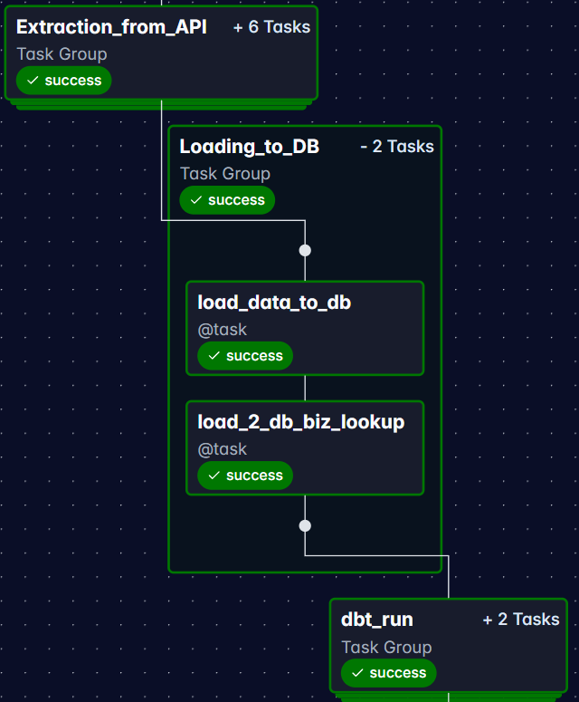
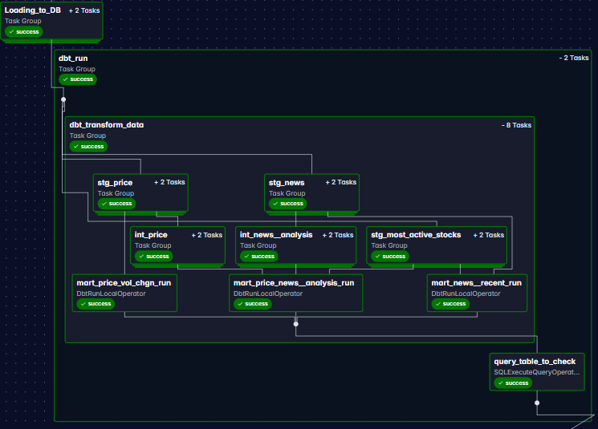
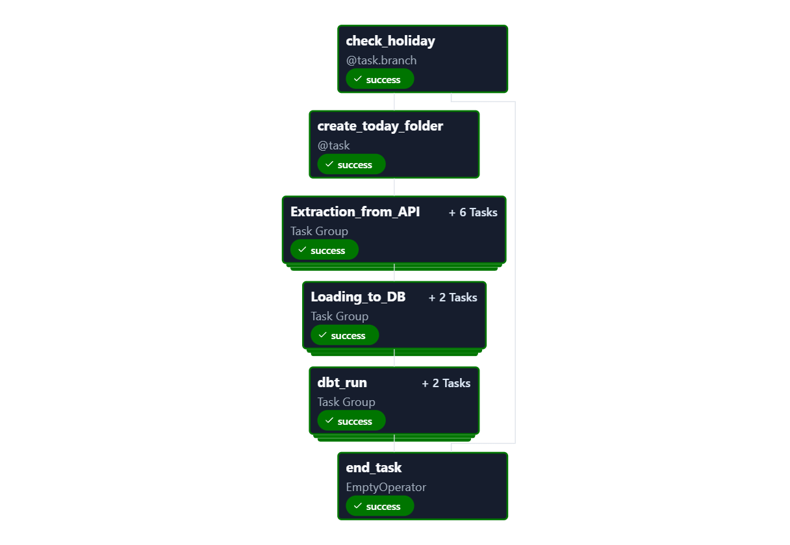
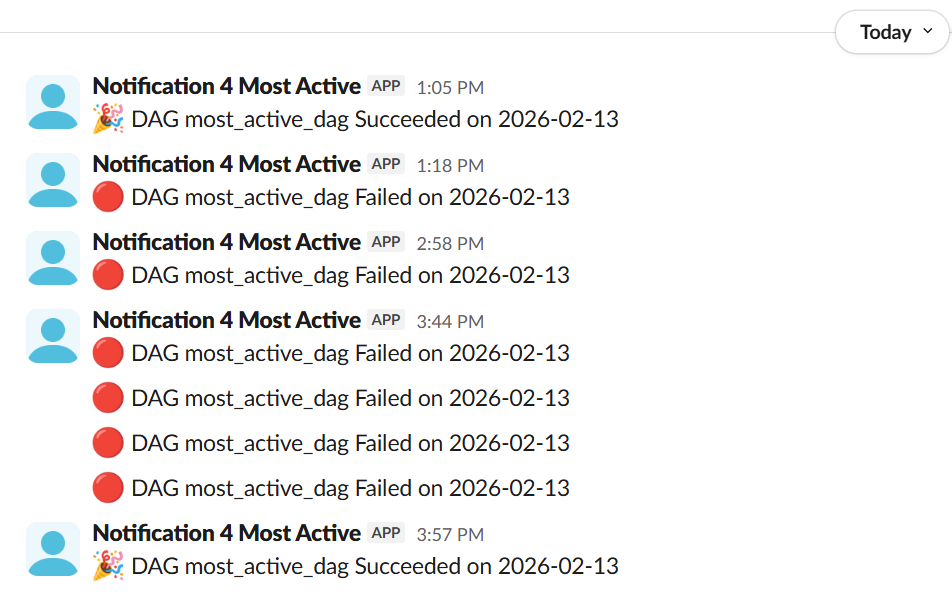
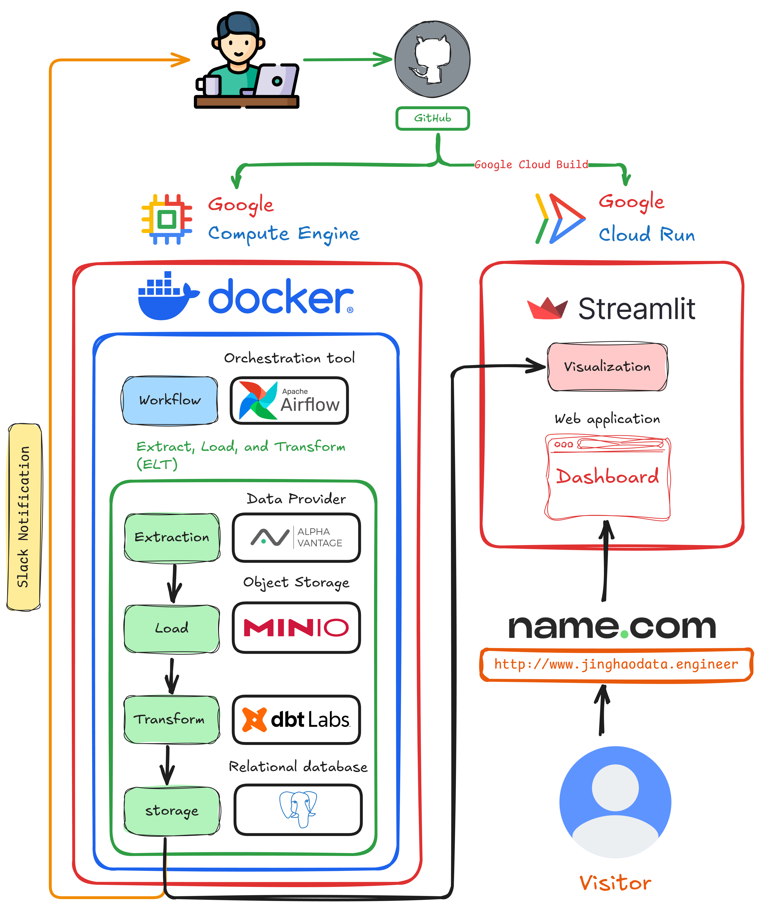
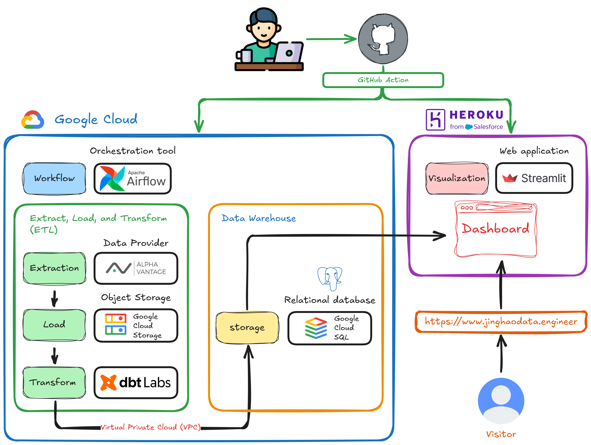

# Data Engineering Capstone - ELT Pipeline

## 🔄 Stock & News Data Pipeline
> 🏗️ **Backend Repository** for the Data Engineering Capstone Project.

### 📖 Table of Contents
- [Project Overview](#-project-overview)
- [Features](#-features)
- [Potential Improvements](#bulb-potential-improvements)
- [Tech Stack](#-tech-stack)
- [Project Structure](#-project-structure)
- [Local Setup](#-local-setup)
- [Reference](#-reference)
- [Connect with me](#connect-with-me)


### 🚀 Project Overview


This repository hosts the **Backend ELT Pipeline** for my Data Engineering Capstone Project. It orchestrates the end-to-end flow of financial data—from API extraction to analytical data marts.

#### Dashboard 
This project complements the **Frontend Visualization Suite**, which consumes the processed data to build interactive dashboards.
> 🌐 **Live Demo:** [JINGHAOdata.engineer](https://www.jinghaodata.engineer/)
Or visit alternative option: [Dashboard make with Tableau Public](https://public.tableau.com/views/TickersAnalysisDashboard/Dashboard?:language=en-US&:sid=&:redirect=auth&:display_count=n&:origin=viz_share_link)

<details>

<summary>About the Tableau version of dashboard</summary>
Since Tableau public free version is not able to connect with database directly, hence I use Google Sheet Apps Script scheduled to extract latest available information from the database. 

Then connect the Tableau dashboard with Google Sheet. 

Google Sheet Apps Script is here: 
```javascript
#Extract Stock Info from postgres database
function importPostgresData() {
  // 1. Skip Weekends
  const today = new Date().getDay();
  if (today === 0 || today === 6) {
    Logger.log('Weekend detected. Skipping sync.');
    return;
  }

  const scriptProperties = PropertiesService.getScriptProperties();
  const address = scriptProperties.getProperty('DB_ADDRESS');
  const dbName = scriptProperties.getProperty('DB_NAME');
  const user = scriptProperties.getProperty('DB_USER');
  const password = scriptProperties.getProperty('DB_PASSWORD');
  const alertEmail = scriptProperties.getProperty('EMAIL');
  
  // 2. 🔴 YOUR MASTER CONTROL CENTER
  // Added 'syncMode' to determine how the table is processed.
  const syncConfigs = [
    { tableName: 'mart_price_news__analysis', syncMode: 'append', dateColName: 'date', dateColIndex: 1 },
    { tableName: 'biz_info_lookup',           syncMode: 'upsert', pkCol: 'Symbol', checkCol: 'LatestQuarter' },
    { tableName: 'mart_price_vol_chgn',       syncMode: 'append', dateColName: 'extraction_date', dateColIndex: 1 },
    { tableName: 'stg_price',                 syncMode: 'append', dateColName: 'extraction_date', dateColIndex: 1 },
    { tableName: 'mart_news__recent',         syncMode: 'append', dateColName: 'extraction_date', dateColIndex: 1 }
  ];

  const dbUrl = `jdbc:postgresql://${address}/${dbName}`;
  const ss = SpreadsheetApp.getActiveSpreadsheet();
  let errorLog = []; 
  
  try {
    // 3. Open ONE connection for all tables
    const conn = Jdbc.getConnection(dbUrl, user, password);
    const stmt = conn.createStatement();
    
    // 4. Loop through each table configuration
    for (let i = 0; i < syncConfigs.length; i++) {
      const config = syncConfigs[i];
      const sheet = ss.getSheetByName(config.tableName);
      
      if (!sheet) {
        Logger.log(`Skipping: Tab named "${config.tableName}" not found.`);
        errorLog.push(`Missing Sheet: ${config.tableName}`);
        continue; 
      }

      try {
        Logger.log(`--- Starting Sync for: ${config.tableName} (${config.syncMode}) ---`);
        
        // ==========================================
        //         MODE 1: UPSERT LOGIC
        // ==========================================
        if (config.syncMode === 'upsert') {
          let sheetData = sheet.getDataRange().getValues();
          let sheetHeaders = sheetData.length > 0 ? sheetData[0] : [];
          
          const results = stmt.executeQuery(`SELECT * FROM ${config.tableName}`); 
          const metaData = results.getMetaData();
          const numCols = metaData.getColumnCount();
          
          let dbHeaders = [];
          let pkDbIdx = -1;
          let checkDbIdx = -1;
          
          for (let c = 1; c <= numCols; c++) {
            const colName = metaData.getColumnName(c);
            dbHeaders.push(colName);
            if (colName === config.pkCol) pkDbIdx = c - 1;
            if (colName === config.checkCol) checkDbIdx = c - 1;
          }

          const dbRows = [];
          while (results.next()) {
            let row = [];
            for (let c = 1; c <= numCols; c++) {
              row.push(results.getString(c));
            }
            dbRows.push(row);
          }
          results.close();

          // Empty sheet fallback (Apps Script returns [['']] for a totally blank sheet)
          const isSheetEmpty = sheetData.length === 0 || (sheetData.length === 1 && String(sheetData[0][0]).trim() === "");
          
          if (isSheetEmpty) {
            const fullData = [dbHeaders].concat(dbRows);
            sheet.clear(); // Wipe the ghost cell
            sheet.getRange(1, 1, fullData.length, fullData[0].length).setValues(fullData);
            Logger.log(`✅ Success: ${config.tableName} - Initial full load (${dbRows.length} rows).`);
            continue;
          }

          const pkSheetIdx = sheetHeaders.indexOf(config.pkCol);
          const checkSheetIdx = sheetHeaders.indexOf(config.checkCol);
          
          const sheetMap = new Map();
          for (let r = 1; r < sheetData.length; r++) {
            sheetMap.set(String(sheetData[r][pkSheetIdx]).trim(), r); 
          }

          let updatedCount = 0;
          let addedCount = 0;

          for (let r = 0; r < dbRows.length; r++) {
            const dbRow = dbRows[r];
            const dbPk = String(dbRow[pkDbIdx]).trim();
            const dbCheck = String(dbRow[checkDbIdx]).trim();

            if (sheetMap.has(dbPk)) {
              const sheetRowIdx = sheetMap.get(dbPk);
              const sheetCheck = String(sheetData[sheetRowIdx][checkSheetIdx]).trim();

              if (dbCheck !== sheetCheck) {
                sheetData[sheetRowIdx] = dbRow; 
                updatedCount++;
              }
            } else {
              sheetData.push(dbRow);
              addedCount++;
            }
          }

          sheet.clear(); 
          sheet.getRange(1, 1, sheetData.length, sheetData[0].length).setValues(sheetData); 
          Logger.log(`✅ Success: ${config.tableName} - Upserted: ${updatedCount} updated, ${addedCount} added.`);

        // ==========================================
        //         MODE 2: APPEND LOGIC
        // ==========================================
        } else if (config.syncMode === 'append') {
          const lastRow = sheet.getLastRow();
          let maxDateStr = null;
          
          if (lastRow > 1 && config.dateColName) { 
            const lastDateVal = sheet.getRange(lastRow, config.dateColIndex).getValue();
            if (lastDateVal instanceof Date) {
              const timeZone = Session.getScriptTimeZone();
              maxDateStr = Utilities.formatDate(lastDateVal, timeZone, "yyyy-MM-dd");
            } else {
              maxDateStr = lastDateVal.toString().trim();
            }
          }

          let query = `SELECT * FROM ${config.tableName}`;
          if (maxDateStr && config.dateColName) {
            query += ` WHERE ${config.dateColName} > '${maxDateStr}'`;
          }
          if (config.dateColName) {
            query += ` ORDER BY ${config.dateColName} ASC`; 
          }
          
          const results = stmt.executeQuery(query); 
          const metaData = results.getMetaData();
          const numCols = metaData.getColumnCount();
          const dataBatch = [];
          
          if (lastRow === 0) {
            let headers = [];
            for (let col = 1; col <= numCols; col++) {
              headers.push(metaData.getColumnName(col));
            }
            dataBatch.push(headers);
          }
          
          while (results.next()) {
            let row = [];
            for (let col = 1; col <= numCols; col++) {
              row.push(results.getString(col));
            }
            dataBatch.push(row); 
          }
          results.close();
          
          if (dataBatch.length > 0) {
            const startRow = lastRow === 0 ? 1 : lastRow + 1;
            sheet.getRange(startRow, 1, dataBatch.length, dataBatch[0].length).setValues(dataBatch);
            Logger.log(`✅ Success: ${config.tableName} - Appended ${lastRow === 0 ? dataBatch.length - 1 : dataBatch.length} new rows.`);
          } else {
            Logger.log(`➡️ Skipped: ${config.tableName} - No new records found.`);
          }
        }
        
      } catch (tableError) {
        Logger.log(`❌ Error on ${config.tableName}: ${tableError.toString()}`);
        errorLog.push(`Error on ${config.tableName}: ${tableError.toString()}`);
      }
    } // End of loop
    
    stmt.close();
    conn.close();
    
    if (errorLog.length > 0) {
      const sheetUrl = ss.getUrl();
      const body = `Your database sync completed, but some tables failed.\n\nErrors:\n${errorLog.join('\n')}\n\nSheet:\n${sheetUrl}`;
      MailApp.sendEmail(alertEmail, '⚠️ Partial Database Sync Failure', body);
    }
    
  } catch (e) {
    Logger.log('Critical Connection Error: ' + e.toString());
    MailApp.sendEmail(alertEmail, '🚨 Critical Database Connection Failure', `Error:\n${e.toString()}\n\nSheet:\n${SpreadsheetApp.getActiveSpreadsheet().getUrl()}`);
  }
}
```


</details>


<details>

<summary>Screenshot of the Dashboard</summary>

#### :exclamation: In case the app is down.

<details>

<summary>When the expanders are on: </summary>



</details>

<details>

<summary>When the expanders are off: </summary>



</details>

</details>

👉 [View Frontend Repository](https://github.com/chenjinghao/de-project-2-Streamlit-4-Viz)

Together, they demonstrate a robust data platform capable of handling ingestion, storage, transformation, and serving.

#### 🏗️ Methodology: Decomposition & Iterative Learning

To bridge the gap between theory and practice, I applied a strategy rooted in **Decomposition** and **Just-In-Time (JIT) Learning**. This approach allowed me to construct a strong foundation for my Data Engineering career:

1.  **🔍 Research & Scope**: I first analyzed the Data Engineering landscape to identify industry-standard tools and core responsibilities.
2.  **🧩 Decomposition**: I broke the complex pipeline down into manageable components (Orchestration, Transformation, Storage).
3.  **📚 Learn & Implement**:
    *   **Orchestration**: I took specialized courses on **Apache Airflow**, then immediately built the ingestion logic for this project.
    *   **Transformation**: I shifted focus to **dbt**, mastering analytics engineering concepts before implementing the transformation layer of this project.

This iterative process ensured that every component was built with a deep understanding of the underlying technologies.

### 🌟 Features

#### 1. Data Orchestration & Ingestion (Airflow)
*   **Avoid Duplicate Extraction**: The extraction workflow implements logic to prevent redundant API calls, ensuring efficient data ingestion. Check the **_Task Group: Extract Stock Info_** for more details in **_Airflow Task Flow Diagram_** collapsed section.

*   **Hybrid Storage Strategy**:
    *   **Data Lake (MinIO)**: Raw API responses are stored in S3-compatible object storage for auditability and replayability.
    *   **Data Warehouse (PostgreSQL)**: Structured data is loaded for high-performance querying.
*   **Slack Alerts**: Real-time notifications for pipeline successes or failures.

<details>

<summary>Airflow Task Flow Diagram</summary>

   <details>

   <summary>Task Group: Extract Stock Info</summary>
   
   The flow is designed to avoid duplicate extraction from API since Alpha Vantage enforces a 25-request-per-day limit on free accounts.

   

   </details>

   <details>

   <summary>Task Group: Load to Database</summary>

   

   </details>

   <details>

   <summary>Task Group: DBT run</summary>

   

   </details>



</details>

<details>

<summary>Slack Notification</summary>



</details>

#### 2. Data Transformation (dbt)
*   **Modular Architecture**: Follows the Staging -> Intermediate -> Mart structure.
*   **Complex Logic**: Calculates rolling averages (100-day), volatility metrics, and aggregates news sentiment scores.
*   **Data Quality**: Implements rigorous testing within the pipeline:
    *   `unique` & `not_null` checks for primary keys.
    *   `accepted_values` for sentiment labels (e.g., 'Bullish', 'Bearish').
    *   Custom tests for data freshness.

#### 3. Infrastructure & DevOps


<details>

<summary>Infrastructure ver. 1 (Legacy)</summary>

   ### Google composer + cloud SQL

> *Note: This infrastructure costs approximately USD 50+ per month after taking free tier quota into consideration. However, it is easier to setup, and it runs faster than Google Cloud VM*



</details>

### :bulb: Potential Improvements

*   **Advanced Data Quality**: Integrating a dedicated tool like **Great Expectations** could enhance data validation. However, given that the data provider delivers structured data and the volume is relatively small, I opted to rely on **dbt's built-in testing features**. This approach avoids the resource overhead of deploying additional services on the Virtual Machine (VM), ensuring optimal performance and cost-effectiveness.

### 🛠️ Tech Stack

*   **Orchestration**: Apache Airflow and Cosmos from Astronomer 
*   **Transformation**: dbt Core (Data Build Tool)
*   **Languages**: Python, SQL
*   **Database**: PostgreSQL
*   **Object Storage**: MinIO (S3 Compatible)
*   **Infrastructure**: Docker, Google Cloud Platform (GCP)
*   **CI/CD**: GitHub Actions

### 📂 Project Structure

```text
de-project-1-airflow-dbt-4-ELT/
├── dags/                        # Airflow DAGs (Extraction logic)
├── include/
│   ├── connection/              # Connection to Minio (Object storage),
│   │                              optional to connect Google Cloud Storage
│   ├── dbt/my_project/          # dbt project (Transformation logic)
│   │   ├── models/              # SQL models (Staging, Marts)
│   │   └── dbt_project.yml      # dbt configuration
│   └── tasks/                   # Task groups
│   │   ├── checking_b4_extraction.py   # Check to avoid duplication and holiday
│   │   ├── extract_stock_info.py       # Extract info. from Alpha Vantage API
│   │   └── load_2_db.py                # Load data to PostgreSQL   
├── .github/workflows/           # CI/CD deployment pipelines
├── docker-compose.override.yml  # Local infrastructure (MinIO, Postgres)
├── requirements.txt             # Python dependencies
└── README.md
```

### ⚙️ Local Setup

1.  **Prerequisites**
    *   Docker Desktop installed and running.
    *   Astro CLI installed.

2.  **Clone the repository**
    ```bash
    git clone https://github.com/chenjinghao/de-project-1-airflow-dbt-4-ELT.git
    cd de-project-1-airflow-dbt-4-ELT
    ```

3.  **Configure Environment**
    Create a `.env` file in the root directory with your credentials:

    ```bash
    # Postgres
    POSTGRES_USER=postgres
    POSTGRES_PASSWORD=postgres
    POSTGRES_DB=stocks_db
    POSTGRES_PORT=5000

    # MinIO
    MINIO_ROOT_USER=minioadmin
    MINIO_ROOT_PASSWORD=minioadmin

    # APIs
    ALPHA_VANTAGE_API_KEY=your_api_key
    SLACK_API_TOKEN=your_slack_token
    ```

      - .gitignore this file
      - The variables defined in `.env` will pass to `docker-compose.override.yml`
         ```bash
         #use following command to check 
         docker compose -f docker-compose.override.yml config
         ```

4.  **Start the Airflow Environment**
    ```bash
    astro dev start
    ```
    *   **Airflow UI**: http://localhost:8080
    *   **MinIO Console**: http://localhost:19001
    *   **pgAdmin**: http://localhost:5800 
5. **Set up Airflow connections and pools**
   * The Astro CLI is designed to automatically import airflow_settings.yaml into your Airflow environment upon startup.
      - or use command ``` astro dev object import ```
   * Environment Variables defined in `.env` must have the same name as in `airflow_settings.yaml`

6. **Common Issues**
   * Port 5432 taken by another image
        - Solution:
        ```bash
        E:\myprojects\de-project-1-airflow-dbt-4-ELT>netstat -ano|findstr :5432
        TCP    127.0.0.1:5432         0.0.0.0:0              LISTENING       41692

        E:\myprojects\de-project-1-airflow-dbt-4-ELT>taskkill /pid 41692 /f
        SUCCESS: The process with PID 41692 has been terminated.
        ```
### Reference
*   **Courses**
      *   [Learn Apache Airflow from Astronomer Academy](https://academy.astronomer.io)
      *   [Apache Airflow: The Hands-On Guide](https://www.udemy.com/course/the-ultimate-hands-on-course-to-master-apache-airflow/)
      *   [dbt Certified Developer Path](https://learn.getdbt.com/learn/learning-path/dbt-certified-developer)
      *   **YouTube**
            -   [Data Engineering Zoomcamp](https://datatalks.club/blog/data-engineering-zoomcamp.html)
            -   [How to build an automated data pipeline using Airflow, dbt, Postgres, and Superset](https://youtu.be/vMgFadPxOLk?si=Iq_KD8kIq0kHRmTr)
            -   [Code along - build an ELT Pipeline in 1 Hour (dbt, Snowflake, Airflow)](https://youtu.be/OLXkGB7krGo?si=INsSOx6lxBelpgPw)
            -   [How to Add Slack Notifications to Your Airflow DAG's with Airflow Notifiers!](https://youtu.be/4yQJWnhKEa4?si=YINvm_1zTnCQJmmF)

*   **Documentation**
      *   [Astronomer Documentation](https://www.astronomer.io/docs)
      *   [dbt Documentation](https://docs.getdbt.com/docs/build/documentation)
      *   [Alpha Vantage API](https://www.alphavantage.co)
      *   [Slack API](https://api.slack.com)
      *   [MinIO Documentation](https://min.io/docs)
      *   [PostgreSQL Documentation](https://www.postgresql.org/docs/)
      *   [Docker Documentation](https://docs.docker.com)

## Connect with me
To know more about me and my projects, please visit my personal website: 

:globe_with_meridians: [https://adamchenjinghao.notion.site](https://adamchenjinghao.notion.site)

:email: [Adam_CJH@outlook.com](mailto:Adam_CJH@outlook.com)
:raising_hand_man: [Linkedin.com/in/chenjinghao/](https://www.linkedin.com/in/adam-cjh)
